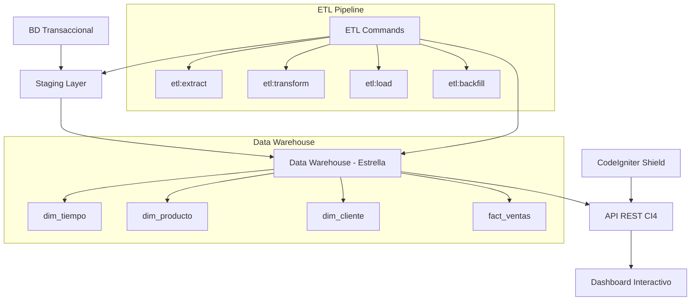

# 🏗️ **Arquitectura del Sistema ETL-DW**

## **1. Diagrama de Alto Nivel**



## **2. Componentes del Sistema**

### **2.1 Capa de Datos**

#### **BD Transaccional (OLTP)**
- **Propósito**: Sistema fuente con datos operacionales
- **Características**: Normalizada, optimizada para transacciones
- **Tablas ejemplo**: `orders`, `order_items`, `products`, `customers`

#### **Staging Layer**
- **Propósito**: Área temporal para extracción y transformación
- **Características**: Estructura plana, datos en bruto
- **Tablas**: `stg_orders`, `stg_customers`, `stg_products`

#### **Data Warehouse (OLAP)**
- **Modelo**: Estrella (Star Schema)
- **Optimización**: Consultas analíticas, agregaciones
- **Componentes**: Dimensiones + Tabla de Hechos

### **2.2 Modelo Estrella - Especificación**

#### **Dimensión Tiempo (`dim_tiempo`)**
```sql
- tiempo_sk (BIGINT, PK, Surrogate Key)
- fecha_natural (DATE, Natural Key)
- año (INT)
- trimestre (INT)
- mes (INT)
- semana (INT)
- dia (INT)
- dia_semana (VARCHAR)
- es_fin_semana (BOOLEAN)
- es_feriado (BOOLEAN)
```

#### **Dimensión Producto (`dim_producto`)**
```sql
- producto_sk (BIGINT, PK, Surrogate Key)
- producto_id (VARCHAR, Natural Key)
- producto_nombre (VARCHAR)
- familia_id (VARCHAR)
- familia_nombre (VARCHAR)
- categoria (VARCHAR)
- precio_lista (DECIMAL)
- activo (BOOLEAN)
```

#### **Dimensión Cliente (`dim_cliente`)**
```sql
- cliente_sk (BIGINT, PK, Surrogate Key)
- cliente_id (VARCHAR, Natural Key)
- cliente_nombre (VARCHAR)
- segmento (VARCHAR)
- ciudad (VARCHAR)
- region (VARCHAR)
- pais (VARCHAR)
- activo (BOOLEAN)
```

#### **Tabla de Hechos (`fact_ventas`)**
```sql
- venta_sk (BIGINT, PK, Surrogate Key)
- tiempo_sk (BIGINT, FK)
- producto_sk (BIGINT, FK)
- cliente_sk (BIGINT, FK)
- orden_id (VARCHAR)
- linea_numero (INT)
- cantidad (DECIMAL)
- precio_unitario (DECIMAL)
- monto_linea (DECIMAL)
- descuento (DECIMAL)
- costo (DECIMAL)
- margen (DECIMAL)
```

### **2.3 Pipeline ETL**

#### **Comandos Spark**
1. **`etl:extract`**: Extracción desde BD transaccional
2. **`etl:transform`**: Transformación y limpieza
3. **`etl:load`**: Carga a DW
4. **`etl:backfill`**: Reproceso histórico

#### **Tablas de Control**
```sql
etl_runs:
- run_id (BIGINT, PK)
- command (VARCHAR)
- status (ENUM: running, success, failed)
- started_at (TIMESTAMP)
- ended_at (TIMESTAMP)
- parameters (JSON)

etl_run_steps:
- step_id (BIGINT, PK)
- run_id (BIGINT, FK)
- step_name (VARCHAR)
- status (ENUM: running, success, failed)
- rows_affected (BIGINT)
- error_message (TEXT)
- started_at (TIMESTAMP)
- ended_at (TIMESTAMP)

etl_errors:
- error_id (BIGINT, PK)
- run_id (BIGINT, FK)
- step_id (BIGINT, FK)
- error_type (VARCHAR)
- error_message (TEXT)
- error_data (JSON)
- created_at (TIMESTAMP)
```

## **3. API REST - Especificación**

### **3.1 Endpoints Principales**

#### **GET /api/v1/ventas**
- **Filtros**:
  - `date_from`, `date_to`: Rango de fechas
  - `producto_id`: ID específico de producto
  - `familia_id`: Filtro por familia de productos
  - `cliente_id`: ID específico de cliente
  - `segmento`: Segmento de cliente
  - `region`: Región geográfica

- **Agregaciones**:
  - `metrics`: sum, avg, count, min, max
  - `time_level`: day, week, month, quarter, year
  - `group_by`: producto, cliente, familia, region

- **Comparativas**:
  - `compare_yoy`: Year over Year
  - `compare_wow`: Week over Week
  - `compare_mom`: Month over Month

#### **GET /api/v1/ventas/drill-down**
- **Jerarquías**:
  - Tiempo: año → trimestre → mes → semana → día
  - Producto: familia → producto
  - Cliente: región → segmento → cliente

#### **GET /api/v1/ventas/kpis**
- **Métricas clave**: Total ventas, margen, productos top, clientes top

### **3.2 Formato de Respuesta**
```json
{
  "status": "success",
  "data": {
    "results": [...],
    "aggregations": {...},
    "totals": {...}
  },
  "meta": {
    "execution_id": "uuid",
    "elapsed_ms": 150,
    "total_records": 1000,
    "page": 1,
    "per_page": 50,
    "total_pages": 20
  }
}
```

## **4. Seguridad & Autenticación**

### **4.1 CodeIgniter Shield**
- **Autenticación**: Email/password, remember me
- **Autorización**: Roles y permisos granulares
- **Seguridad**: Hash de passwords, protección CSRF

### **4.2 Roles del Sistema**
- **Admin**: Acceso completo, gestión ETL
- **Analyst**: Acceso a API y dashboard, sin gestión
- **Viewer**: Solo visualización de dashboard

### **4.3 Protección de Rutas**
```php
$routes->group('api/v1', ['filter' => 'auth'], function($routes) {
    $routes->get('ventas', 'Api\VentasController::index');
    $routes->get('ventas/drill-down', 'Api\VentasController::drillDown');
});

$routes->group('admin', ['filter' => 'role:admin'], function($routes) {
    $routes->get('etl', 'Admin\EtlController::index');
    $routes->post('etl/run', 'Admin\EtlController::run');
});
```

## **5. Performance & Optimización**

### **5.1 Índices de Base de Datos**
```sql
-- Fact table indices
CREATE INDEX idx_fact_ventas_tiempo ON fact_ventas (tiempo_sk);
CREATE INDEX idx_fact_ventas_producto ON fact_ventas (producto_sk);
CREATE INDEX idx_fact_ventas_cliente ON fact_ventas (cliente_sk);
CREATE INDEX idx_fact_ventas_composite ON fact_ventas (tiempo_sk, producto_sk, cliente_sk);

-- Dimension indices
CREATE INDEX idx_dim_tiempo_fecha ON dim_tiempo (fecha_natural);
CREATE INDEX idx_dim_producto_familia ON dim_producto (familia_id);
CREATE INDEX idx_dim_cliente_segmento ON dim_cliente (segmento);
```

### **5.2 Configuración ETL**
- **Batch Size**: Configurable (default: 1000 registros)
- **Transacciones**: Commits por batch
- **Memoria**: Procesamiento en chunks para datasets grandes
- **Paralelización**: Posibilidad de múltiples workers

### **5.3 Cache de API**
- **Redis/Memcached**: Cache de consultas frecuentes
- **TTL**: Configurable por endpoint
- **Invalidación**: Automática en actualizaciones ETL

## **6. Monitoreo & Logging**

### **6.1 Métricas ETL**
- Tiempo de ejecución por comando
- Registros procesados por minuto
- Errores y reintentos
- Uso de memoria y CPU

### **6.2 Logs de Aplicación**
- Accesos a API (rate limiting)
- Errores de autenticación
- Queries lentas (> 2 segundos)
- Fallos de ETL

### **6.3 Alertas**
- ETL fallido
- API response time > 5s
- Disk space < 10%
- High error rate

## **7. Despliegue & Entornos**

### **7.1 Entornos**
- **Development**: Local con SQLite/MySQL
- **Testing**: CI/CD con base de datos temporal
- **Production**: MariaDB cluster, Redis cache

### **7.2 CI/CD Pipeline**
```yaml
stages:
  - test: PHPUnit + coverage
  - security: Security scanner
  - build: Docker image
  - deploy: Rolling deployment
  - verify: Health checks
```

### **7.3 Configuración**
- **Environment vars**: Credenciales, URLs, configuración
- **Secrets management**: Vault/AWS Secrets Manager
- **Feature flags**: Habilitar/deshabilitar funcionalidades

---

**Arquitecto**: Juan Fortuna  
**Versión**: 1.0  
**Fecha**: Octubre 2025